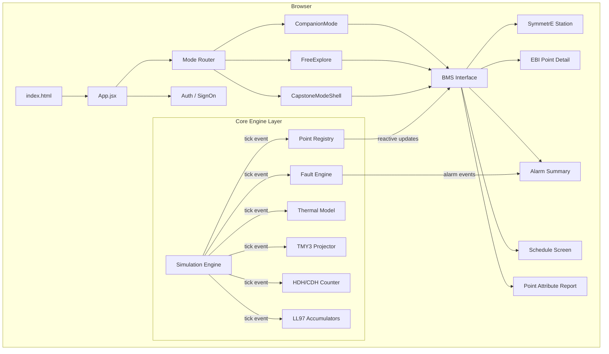
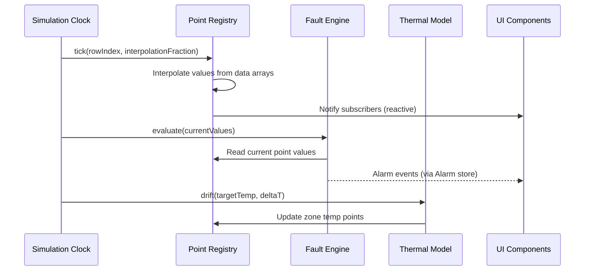
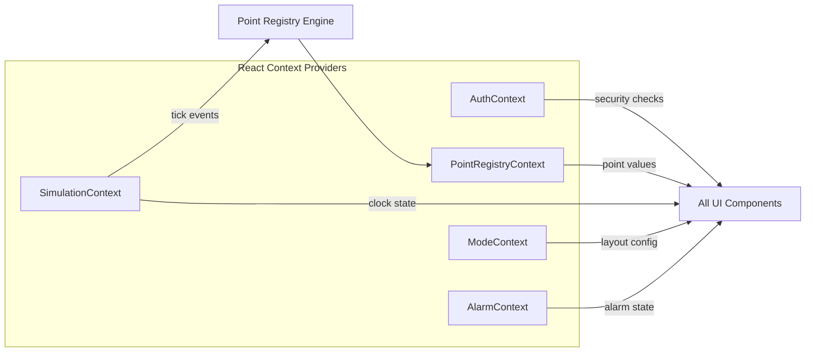

# Design Document: Honeywell BMS Simulator

## Overview

This design specifies a fully offline, browser-based simulator replicating two Honeywell Building Management Systems: SymmetrE R410.2 (graphical AHU operator display) and EBI R700 (Enterprise Buildings Integrator point detail/history). The application targets CTA training participants learning BMS operations at a Four Seasons Hotel facility.

The simulator is a single-page React application served from a single `index.html` entry point. It uses Tailwind CSS (CDN) for styling, baked-in JavaScript arrays for all data (27 BMS points × 1,017 hourly rows, TMY3 weather × 8,760 rows, LL84 constants), and no server-side runtime. Three pedagogical modes (Companion, Free Explore, Capstone) wrap the core BMS interface to serve different training scenarios.

### Key Design Decisions

| Decision | Rationale |
|----------|-----------|
| React with JSX (no TypeScript) | Matches requirement 27.1; keeps build simple |
| Tailwind CDN only | Requirement 27.2 — no other runtime dependencies |
| Single `index.html` entry | Requirement 27.4 — portable static deployment |
| React Context (5 providers) for state | Sufficient for this app's complexity; no external store needed since all state flows from simulation engine |
| Hash-based routing (`#/symmetre`, `#/ebi/:pointId`) | Works offline without server-side route handling; browser back/forward supported |
| In-memory reactive Point Registry | Requirement 23.4 — all UI auto-updates on tick via Context subscription |
| Simulation clock as pub/sub event bus | Decouples data playback from rendering; single source of time truth |
| Canvas-based trend charts (History tab) | Handles 1,017+ data points smoothly; SVG would create excessive DOM nodes for large datasets |
| jsPDF (bundled at build time) for Capstone PDF | Mature library, no runtime CDN needed, supports text layout for worksheet export |
| localStorage for instructor dashboard | Fully offline constraint means no server; localStorage shared across same-origin tabs suffices for single-machine training |
| Component-per-screen architecture | Maps directly to file structure in requirements |

## Architecture

### High-Level System Diagram



### Routing Strategy

Hash-based routing via a lightweight custom router (no react-router dependency):

```
#/auth              → SignOn screen
#/symmetre          → SymmetrE Station (default AHU-4-4)
#/symmetre/:ahuId   → SymmetrE Station for specific AHU
#/ebi/:pointId      → EBI Point Detail (General tab default)
#/ebi/:pointId/:tab → EBI Point Detail on specific tab
#/alarms            → Alarm Summary
#/schedule          → Schedule Screen
#/reports           → Point Attribute Report
#/instructor        → Instructor Dashboard (Engr+ only)
```

The router listens to `hashchange` events and renders the matching screen component. Mode (Companion/FreeExplore/Capstone) is an orthogonal layout wrapper — it doesn't change the route, it adds/removes the side panel.

### Chart Rendering (History Tab)

The History tab uses a **Canvas 2D** approach:

- A single `<canvas>` element with black background renders the area chart
- Cyan fill (`#00BFFF`) for primary series, additional colors for overlays
- Canvas handles up to 1,017 data points without performance issues (vs. SVG which would create 1,017+ DOM nodes)
- Zoom/pan implemented via mouse wheel + drag handlers updating a viewport window (startRow, endRow)
- The data table below the chart is standard HTML `<table>` — only the chart itself uses Canvas
- Axis labels rendered with `ctx.fillText()` at fixed intervals

### PDF Generation (Capstone Export)

Strategy: **jsPDF** bundled at build time (included in the production bundle, no runtime fetch)

- `PDFExporter.js` creates an A4 document
- Layout: header with title + student name + timestamp, then 5 sections each with title, prompt text (grey), and student response (black)
- Text wrapping via `doc.splitTextToSize()` with 170mm max width
- Page breaks inserted automatically when content exceeds page height
- Generated as blob, triggered via `URL.createObjectURL()` + programmatic anchor click
- No images or complex formatting — text-only PDF keeps the library footprint minimal

### Instructor Dashboard Communication

Since the app is fully offline (no WebSocket, no server), instructor–student communication uses **localStorage as a shared message bus**:

```
localStorage key: "capstone_submissions"
Value: JSON array of { operator, timestamp, sections[], submitted: true }
```

- When a student submits, their worksheet is appended to this array
- The instructor dashboard reads this array on mount and polls every 5 seconds via `setInterval`
- Both instructor and student tabs run in the same browser (same origin), so they share localStorage
- `storage` events fire cross-tab, but polling is the fallback for same-tab scenarios
- The `UnlockCapstone.jsx` component writes a flag (`capstone_unlocked: true`) that student tabs read to gate capstone access

### Architectural Layers

1. **Data Layer** — Static baked-in arrays (point files, TMY3, LL84, peer benchmarks, reference guide data)
2. **Engine Layer** — Simulation clock, Point Registry (reactive store), Fault Engine, Thermal Model, TMY3 Projector, LL97 Accumulators, HDH/CDH Counter
3. **UI Layer** — SymmetrE Station, EBI Point Detail, Alarm Summary, Schedule Screen, Point Attribute Report
4. **Mode Layer** — Companion, Free Explore, Capstone shells that wrap the UI layer with pedagogical features
5. **Auth Layer** — Sign-on gate enforcing security levels

### Data Flow



## Components and Interfaces

### File Structure

```
src/
├── auth/
│   └── SignOn.jsx              # Auth gate, credential validation, security level assignment
├── ui/
│   ├── symmetre/
│   │   ├── AppChrome.jsx       # Title bar, menu bar, toolbar, status bar container
│   │   ├── BottomStatusBar.jsx # Clock, selected point path, alarm/system tabs
│   │   ├── ZoneTabs.jsx        # Horizontal tab row (water droplet + AHU fan icons)
│   │   ├── ControlsSidebar.jsx # 9-section collapsible panel with editable fields
│   │   ├── AHUGraphic.jsx      # Isometric airflow schematic with live point values
│   │   └── SimultaneousHeatCool.jsx # Amber overlay when PHT>20% && CHW>20%
│   ├── ebi/
│   │   ├── AppChrome.jsx       # EBI-specific chrome (breadcrumb, tab bar)
│   │   ├── PointSidebar.jsx    # Left panel: bar chart, status dots, value, mode
│   │   ├── TabBar.jsx          # 6-tab navigation
│   │   ├── GeneralTab.jsx      # Point metadata display
│   │   ├── HistoryTab.jsx      # Trend chart, period/interval selectors, data table
│   │   ├── AlarmsTab.jsx       # Alarm config and state for selected point
│   │   └── RecentEventsTab.jsx # Chronological state-change log
│   └── shared/
│       ├── PointBadge.jsx      # AI/AO/BI/BO type badge (hover or persistent)
│       ├── OverrideIndicator.jsx # Amber background + "Manual" text
│       ├── StatusDots.jsx      # Hollow/filled circles for Alarm/Fault/Override/OOS
│       ├── WhiteBox.jsx        # Editable field container
│       ├── GreyBox.jsx         # Read-only field container
│       └── ASHRAECallout.jsx   # Standard reference sidebar (55, 62.1, 90.1, 36)
├── alarm/
│   ├── AlarmSummary.jsx        # Full alarm list with filter tree and sorting
│   ├── AlarmIcon.jsx           # 9-state icon renderer
│   └── AlarmBanner.jsx         # Toolbar alarm indicator
├── schedule/
│   ├── WeeklySchedule.jsx      # Day/Time/Value table with Insert/Modify
│   └── ExceptionSchedule.jsx   # Holiday/special-event entries
├── reports/
│   └── PointAttributeReport.jsx # Manual override finder with filter checkboxes
├── data/
│   ├── points/                 # 27 JS arrays × 1,017 rows each
│   ├── weather/                # TMY3 Central Park 8,760 rows
│   ├── building/               # LL84 constants, peer benchmarks
│   └── reference/              # CTA chapter index, ASHRAE standards data
├── modes/
│   ├── CompanionMode.jsx       # 30% right panel, 41 slides, paused clock
│   ├── FreeExplore.jsx         # Full-width, 60x speed, 14 scenarios
│   └── CapstoneModeShell.jsx   # 35% right panel, worksheet, PDF export
├── capstone/
│   ├── WorksheetSection1.jsx   # Section 1 input area
│   ├── WorksheetSection2.jsx   # Section 2 input area
│   ├── WorksheetSection3.jsx   # Section 3 input area
│   ├── WorksheetSection4.jsx   # Section 4 input area
│   ├── WorksheetSection5.jsx   # Section 5 input area
│   ├── WorksheetSidebar.jsx    # Section navigation and progress
│   ├── Verifier.js             # Input completeness checker
│   └── PDFExporter.js          # Browser-side PDF generation (jsPDF)
├── simulation/
│   ├── Engine.js               # Clock, tick loop, speed control, jump
│   ├── PointRegistry.js        # Reactive point store, subscribe/publish, value management
│   ├── FaultEngine.js          # 6 fault rules, alarm generation, deactivation
│   ├── ThermalModel.js         # Zone temp drift calculation (2°F/min max)
│   ├── TMY3Projector.js        # Weather data lookup by hour
│   └── HDHCDHCounter.js        # Heating/Cooling Degree Hour accumulator
├── instructor/
│   ├── Dashboard.jsx           # Submitted worksheets list, viewer
│   └── UnlockCapstone.jsx      # Instructor gate for capstone access
├── App.jsx                     # Root router, mode selection, context providers
└── index.html                  # Single entry point, Tailwind CDN link
```

### Core Interfaces

#### Point Registry (Reactive Store)

```jsx
// src/simulation/PointRegistry.js
const PointRegistry = {
  points: Map<string, Point>,           // keyed by BACnet address
  subscribe(address, callback),         // UI component subscription
  unsubscribe(address, callback),
  getValue(address): number | boolean,
  setValue(address, value, source),      // source: 'simulation' | 'operator' | 'fault'
  getMetadata(address): PointMetadata,
  getAll(): Point[],
  query(filter: FilterCriteria): Point[],
};

// Point shape
interface Point {
  address: string;          // e.g. "AI301@DEV4004"
  name: string;             // e.g. "AHU-4-4 Supply Air Temp"
  type: 'AI' | 'AO' | 'BI' | 'BO';
  units: string;            // e.g. "°F", "%RH", "kBTU"
  min: number;
  max: number;
  covIncrement: number;
  sensorOffset: number;
  currentValue: number | boolean;
  mode: 'Auto' | 'Manual';
  alarmState: AlarmState;
  outOfService: boolean;
  alarmSuppressed: boolean;
  subsystem: 'AHU-4-4' | 'AHU-4-6' | 'Outdoor' | 'CoolingTower';
}
```

#### Simulation Engine Interface

```jsx
// src/simulation/Engine.js
const SimulationEngine = {
  currentRow: number,                    // 1–1017
  speed: '1x' | '60x' | '3600x' | 'pause',
  interpolationFraction: number,         // 0.0–1.0 between rows
  
  start(),
  pause(),
  setSpeed(speed),
  jumpToDate(date): boolean,             // false if out of range
  getCurrentTimestamp(): Date,
  onTick(callback),                      // subscribe to tick events
  offTick(callback),
};
```

#### Fault Engine Interface

```jsx
// src/simulation/FaultEngine.js
const FaultEngine = {
  rules: FaultRule[],                    // F-01 through F-06
  activeAlarms: Map<string, Alarm>,
  
  evaluate(pointValues: Map<string, number>): Alarm[],
  getActiveAlarms(): Alarm[],
};

interface FaultRule {
  id: string;                            // "F-01" through "F-06"
  description: string;
  priority: 'urgent' | 'high';
  condition(values: Map): boolean;
  sourcePoint: string;                   // BACnet address
}
```

#### Alarm Store Interface

```jsx
// src/alarm/AlarmStore.js
interface Alarm {
  id: string;
  timestamp: Date;
  source: string;                        // BACnet address
  condition: string;                     // fault rule ID or alarm type
  priority: 'urgent' | 'high' | 'low' | 'journal';
  description: string;
  value: number | string;
  lifecycle: 'active' | 'inactive';
  acknowledged: boolean;
  operator: string;                      // who acknowledged
  action: string;                        // action taken
}

const AlarmStore = {
  alarms: Alarm[],
  add(alarm),
  acknowledge(alarmId, operator),
  deactivate(alarmId),
  query(filter): Alarm[],
  sort(column, direction): Alarm[],
};
```

#### Mode Controller Interface

```jsx
// src/modes/ModeController.js
const ModeController = {
  currentMode: 'companion' | 'freeExplore' | 'capstone',
  
  setMode(mode),
  getLayoutConfig(): { mainWidth: string, panelWidth: string },
};

// CompanionMode specifics
interface CompanionState {
  currentSlide: number;                  // 1–41
  totalSlides: 41;
  promptText: string;
  scenarioParams: object;
}

// FreeExplore specifics
interface FreeExploreState {
  selectedScenario: number | null;       // 1–14
  scenarios: Scenario[];
}

// Capstone specifics
interface CapstoneState {
  sections: WorksheetSection[];          // 5 sections
  autoSaveTimer: number;
  submitted: boolean;
}
```

#### Auth Context Interface

```jsx
// src/auth/AuthContext.js
interface AuthState {
  authenticated: boolean;
  operator: string;
  securityLevel: 'ViewOnly' | 'AckOnly' | 'Oper' | 'Supv' | 'Engr' | 'Mngr';
  
  canWrite(): boolean;                   // Oper+
  canAcknowledge(): boolean;             // AckOnly+
  canModifySchedules(): boolean;         // Supv+
  canConfigurePoints(): boolean;         // Engr+
  canManageAccounts(): boolean;          // Mngr only
}
```

#### Hash Router

```jsx
// src/Router.js
const Router = {
  currentRoute: string,                  // e.g. "#/symmetre" or "#/ebi/AI301@DEV4004/history"
  params: object,                        // parsed route params { pointId, tab, ahuId }
  
  navigate(hash): void,                  // window.location.hash = hash
  onRouteChange(callback): void,         // subscribe to hashchange
  parseRoute(hash): { screen, params },  // decompose hash into screen + params
};
```

#### LL97 Accumulator Interface

```jsx
// src/simulation/LL97Accumulator.js
const LL97Accumulator = {
  totalEnergy_kBTU: number,
  electricEnergy_kWh: number,
  steamEnergy_kBTU: number,
  ghgEmissions_mtCO2e: number,
  
  tick(hourlyData, ll84Constants): void, // increment by hourly consumption
  reset(): void,                          // zero all accumulators
  getValues(): AccumulatorValues,
};
```

#### CSV Exporter Interface

```jsx
// src/reports/CSVExporter.js
const CSVExporter = {
  generate(point, startRow, endRow, interval, tmy3Data): string,  // CSV content
  download(csvContent, pointName, startDate, endDate): void,       // trigger browser download
};
```

### Component Communication



All state flows through React Context providers. Components subscribe to the contexts they need. The Simulation Engine drives ticks, which update the Point Registry, which triggers re-renders in subscribed components.

## Data Models

### Point Data Files (27 files)

Each point file is a JavaScript array of 1,017 numeric values representing hourly readings from May 1, 2026 00:00 through June 12, 2026 08:00.

```javascript
// src/data/points/AHU44_SupplyAirTemp.js
export const AHU44_SupplyAirTemp = {
  address: "AI301@DEV4004",
  name: "AHU-4-4 Supply Air Temp",
  type: "AI",
  units: "°F",
  min: 40,
  max: 120,
  covIncrement: 0.5,
  sensorOffset: 0,
  subsystem: "AHU-4-4",
  data: [55.2, 55.4, 55.1, /* ... 1017 values */]
};
```

### TMY3 Weather Data

```javascript
// src/data/weather/tmy3_central_park.js
export const TMY3 = [
  { hour: 1, dryBulb: 32.4, dewPoint: 25.1, relHumidity: 72, wetBulb: 29.8, enthalpy: 12.4 },
  // ... 8,760 rows
];
```

### LL84 Building Constants

```javascript
// src/data/building/ll84_constants.js
export const LL84 = {
  annualSiteEnergy_kBTU: 98500000,
  annualElectric_kWh: 12400000,
  annualSteam_kBTU: 45600000,
  annualGHG_mtCO2e: 5230,
  grossFloorArea_sqft: 365000,
  yearData: {
    2022: { siteEnergy: 101200000, electric: 12800000, steam: 47100000, ghg: 5410 },
    2023: { siteEnergy: 98500000, electric: 12400000, steam: 45600000, ghg: 5230 }
  }
};
```

### Peer Cohort Benchmarks

```javascript
// src/data/building/peer_benchmarks.js
export const PeerBenchmarks = [
  { name: "Luxury Hotel A", type: "Full-Service Hotel", carbonIntensity: 14.3, limit2024: 15.0 },
  { name: "Luxury Hotel B", type: "Full-Service Hotel", carbonIntensity: 12.8, limit2024: 15.0 },
  { name: "Mixed-Use Tower C", type: "Mixed Residential", carbonIntensity: 8.2, limit2024: 10.0 },
  { name: "Office Building D", type: "Class A Office", carbonIntensity: 9.5, limit2024: 11.0 },
];
```

### Fault Rules Definition

```javascript
// src/simulation/faultRules.js
export const FaultRules = [
  {
    id: "F-01",
    description: "Simultaneous heating and cooling",
    priority: "urgent",
    sourcePoints: ["AO_PHT@DEV4004", "AO_CHW@DEV4004"],
    condition: (values) => values.get("AO_PHT@DEV4004") > 20 && values.get("AO_CHW@DEV4004") > 20,
  },
  {
    id: "F-02",
    description: "Supply air temperature deviation",
    priority: "high",
    sourcePoints: ["AI_SAT@DEV4004", "AO_SAT_SP@DEV4004"],
    condition: (values) => Math.abs(values.get("AI_SAT@DEV4004") - values.get("AO_SAT_SP@DEV4004")) > 5,
  },
  {
    id: "F-03",
    description: "AHU running during unoccupied hours",
    priority: "high",
    sourcePoints: ["BI_FAN@DEV4004", "BI_OCC@DEV4004"],
    condition: (values) => values.get("BI_FAN@DEV4004") === 1 && values.get("BI_OCC@DEV4004") === 0,
  },
  {
    id: "F-04",
    description: "Outdoor air damper fully closed during occupied hours",
    priority: "urgent",
    sourcePoints: ["AO_OAD@DEV4004", "BI_OCC@DEV4004"],
    condition: (values) => values.get("AO_OAD@DEV4004") < 5 && values.get("BI_OCC@DEV4004") === 1,
  },
  {
    id: "F-05",
    description: "Economizer not active when OAT permits",
    priority: "high",
    sourcePoints: ["AI_OAT@DEV5000", "AO_OAD@DEV4004", "AO_CHW@DEV4004"],
    condition: (values) => values.get("AI_OAT@DEV5000") < 55 && values.get("AO_OAD@DEV4004") < 50 && values.get("AO_CHW@DEV4004") > 20,
  },
  {
    id: "F-06",
    description: "CO2 exceeds ventilation threshold",
    priority: "urgent",
    sourcePoints: ["AI_CO2@DEV4004"],
    condition: (values) => values.get("AI_CO2@DEV4004") > 800,
  },
];
```

### Companion Mode Slides

```javascript
// src/data/reference/companionSlides.js
export const CompanionSlides = [
  { slide: 1, title: "Welcome to CTA BMS Training", prompt: "...", scenario: null },
  { slide: 2, title: "Signing On", prompt: "...", scenario: "normal_operation" },
  // ... 41 slides total
  { slide: 41, title: "Course Summary", prompt: "...", scenario: null },
];
```

### Free Explore Scenarios

```javascript
// src/data/reference/scenarios.js
export const Scenarios = [
  { id: 1, name: "Normal Summer Operation", description: "...", startRow: 1, pointOverrides: {} },
  { id: 2, name: "Economizer Lockout", description: "...", startRow: 200, pointOverrides: { ... } },
  // ... 14 scenarios total
];
```

### Alarm 9-State Icon Matrix

| Priority \ State | Active + Unacknowledged | Active + Acknowledged | Inactive + Unacknowledged |
|-----------------|------------------------|-----------------------|---------------------------|
| Urgent | 🔴 flashing red | 🔴 solid red | ⚪ red outline |
| High | 🟡 flashing amber | 🟡 solid amber | ⚪ amber outline |
| Low | 🔵 flashing blue | 🔵 solid blue | ⚪ blue outline |

### Thermal Drift Model

```javascript
// Zone temperature drift: exponential approach to target
// maxRate: 2°F per simulated minute
// settling: within 30 simulated minutes

function driftZoneTemp(current, target, elapsedMinutes) {
  const tau = 10; // time constant in minutes
  const delta = target - current;
  const maxStep = 2 * elapsedMinutes; // cap at 2°F/min
  const exponentialStep = delta * (1 - Math.exp(-elapsedMinutes / tau));
  return current + Math.sign(exponentialStep) * Math.min(Math.abs(exponentialStep), maxStep);
}
```

### Security Level Hierarchy

```javascript
const SECURITY_LEVELS = ['ViewOnly', 'AckOnly', 'Oper', 'Supv', 'Engr', 'Mngr'];

// Each level includes all privileges of lower levels
function hasPrivilege(userLevel, requiredLevel) {
  return SECURITY_LEVELS.indexOf(userLevel) >= SECURITY_LEVELS.indexOf(requiredLevel);
}
```

### Worksheet Auto-Save Schema (localStorage)

```javascript
// Key: "capstone_worksheet_{operator}"
{
  sections: [
    { id: 1, title: "...", content: "..." },
    { id: 2, title: "...", content: "..." },
    { id: 3, title: "...", content: "..." },
    { id: 4, title: "...", content: "..." },
    { id: 5, title: "...", content: "..." },
  ],
  lastSaved: "2026-06-01T14:30:00Z",
  submitted: false
}
```


## Correctness Properties

*A property is a characteristic or behavior that should hold true across all valid executions of a system — essentially, a formal statement about what the system should do. Properties serve as the bridge between human-readable specifications and machine-verifiable correctness guarantees.*

### Property 1: Invalid Credentials Rejection

*For any* operator name and password pair that does not match a configured demo account, submitting those credentials SHALL result in an error message, password field cleared, and the UI remaining on the Auth_Screen.

**Validates: Requirements 1.3**

### Property 2: Security Level Privilege Hierarchy

*For any* pair of security levels (A, B) where A is higher in the hierarchy than B, a user authenticated at level A SHALL have all privileges granted to level B.

**Validates: Requirements 1.5**

### Property 3: OA Data Strip Values Match Simulation Row

*For any* simulation row index in [1, 1017] and any interpolation fraction in [0.0, 1.0), the Outside Air data strip values (OAT, humidity, wetbulb, dewpoint, enthalpy) SHALL equal the linearly interpolated values from the corresponding point data arrays at that position, formatted to one decimal place.

**Validates: Requirements 3.1, 3.2, 3.3**

### Property 4: Field Box Styling by State and Security

*For any* point and any security level, the Controls Sidebar SHALL render the point's value box as: white if the point is operator-editable at the current security level, grey if the point is program-controlled or the security level is insufficient for editing, or blue if the point is in Manual_Override state.

**Validates: Requirements 5.3, 5.4**

### Property 5: Out-of-Range Input Rejection

*For any* point in the Point_Registry and any numeric value outside the point's configured [min, max] range, submitting that value SHALL be rejected and an error SHALL be displayed identifying the acceptable range.

**Validates: Requirements 5.6**

### Property 6: Simultaneous Heat/Cool Warning

*For any* pair of Preheat Coil output value and Chilled Water Coil output value, the amber warning overlay on the AHU_Graphic SHALL be visible if and only if both values exceed 20%.

**Validates: Requirements 6.4**

### Property 7: Breadcrumb Path Derivation

*For any* point in the Point_Registry, the EBI breadcrumb navigation bar SHALL display a hierarchical path (System > Subsystem > Point Name) correctly derived from that point's BACnet technical address.

**Validates: Requirements 7.2**

### Property 8: Status Dot Rendering

*For any* combination of boolean states (alarm active, fault active, overridden, out-of-service), each status dot SHALL render as a hollow gray circle when its corresponding state is inactive, and as a filled colored circle (red for alarm, amber for fault, amber for overridden, gray for out-of-service) when active.

**Validates: Requirements 8.2, 8.3, 8.4**

### Property 9: General Tab Metadata Display

*For any* point in the Point_Registry, the General tab SHALL display all applicable metadata fields as read-only: for analog points (AI/AO) — name, address, type, units, range, COV increment, and sensor offset; for binary points (BI/BO) — name, address, and type only, omitting range, COV, and offset.

**Validates: Requirements 9.1, 9.2, 9.3**

### Property 10: History Table Temporal Ordering

*For any* set of historical data rows for a point within a selected period, the data table below the trend chart SHALL display rows sorted by timestamp in descending order (newest-first).

**Validates: Requirements 10.4**

### Property 11: Recent Events Sorted with Complete Fields

*For any* point with state-change events, the Recent Events tab SHALL display events sorted by timestamp descending, with each entry containing: timestamp, event type, previous value/state, and new value/state.

**Validates: Requirements 11.1, 11.2**

### Property 12: Alarm Tab Configuration and State Display

*For any* point with alarm configuration, the Alarms tab SHALL display alarm type, limit threshold, deadband, priority, enable state, and current lifecycle/acknowledgment state matching the 9-state classification.

**Validates: Requirements 12.1, 12.2**

### Property 13: 9-State Alarm Icon Distinctness

*For any* alarm with urgency level (urgent, high, low) and lifecycle-acknowledgment state (active-unacknowledged, active-acknowledged, inactive-unacknowledged), the rendered icon SHALL be visually distinct — one unique icon per combination of the 9 states.

**Validates: Requirements 13.3**

### Property 14: Alarm List Sort Toggle

*For any* column in the Alarm_Summary list and any set of alarm data, clicking the column header SHALL sort the list by that column ascending on the first click, and toggling to descending on the subsequent click of the same header.

**Validates: Requirements 13.5**

### Property 15: Alarm Filter Tree Selection

*For any* node selected in the location/filter tree and any alarm data set, the alarm list SHALL display only alarms belonging to the selected group or its descendant groups.

**Validates: Requirements 13.6**

### Property 16: Point Attribute Report OR-Logic Filtering

*For any* combination of selected filter checkboxes (In Manual, Out of service, Alarm suppressed) and any Point_Registry state, the results table SHALL contain exactly those points matching at least one selected filter criterion (OR logic).

**Validates: Requirements 15.2**

### Property 17: Simulation Speed Change Continuity

*For any* current row position and any speed transition (between 1x, 60x, 3600x, or from pause), playback SHALL continue from the current row without resetting or skipping data.

**Validates: Requirements 16.3**

### Property 18: Date Jump Range Validation

*For any* date outside the May 1–June 12, 2026 range, the jumpToDate function SHALL return false and reject the input without changing the current simulation position.

**Validates: Requirements 16.5**

### Property 19: Linear Interpolation Between Hourly Samples

*For any* row index i in [1, 1016] and any interpolation fraction f in (0.0, 1.0), the interpolated point value SHALL equal `data[i-1] + f * (data[i] - data[i-1])` (linear interpolation between adjacent samples).

**Validates: Requirements 17.3**

### Property 20: Fault Alarm Generation

*For any* set of point values where a fault rule's condition evaluates to true and no active alarm exists for that rule, the Fault Engine SHALL generate exactly one alarm entry with the correct timestamp, source BACnet address, fault rule ID, priority, and description.

**Validates: Requirements 17.2, 17.5**

### Property 21: Fault Clearing Preserves Acknowledgment

*For any* alarm in active state, when the corresponding fault condition evaluates to false, the alarm SHALL transition to inactive lifecycle while its acknowledgment state (acknowledged or unacknowledged) remains unchanged.

**Validates: Requirements 17.4**

### Property 22: LL97 Accumulator Increment

*For any* hourly tick, each LL97 accumulator (energy kBTU, electric kWh, steam kBTU, GHG mtCO2e) SHALL increment by the correct hourly consumption value derived from point data and LL84 constants.

**Validates: Requirements 18.2**

### Property 23: LL97 Accumulator Reset

*For any* scenario load or clock reset event, all four LL97 accumulator values SHALL equal zero immediately after the reset.

**Validates: Requirements 18.3**

### Property 24: Thermal Drift Rate Cap

*For any* current zone temperature, target temperature, and elapsed simulated time, the thermal drift SHALL never exceed 2°F per simulated minute.

**Validates: Requirements 19.1**

### Property 25: Thermal Settling Convergence

*For any* initial zone temperature and target temperature within the operating range, after 30 simulated minutes of continuous drift, the zone temperature SHALL be within 0.5°F of the target value.

**Validates: Requirements 19.2**

### Property 26: Companion Slide Navigation Bounds

*For any* navigation action (forward or backward) and any current slide number, the resulting slide number SHALL remain within [1, 41], never advancing beyond slide 41 or before slide 1.

**Validates: Requirements 20.5**

### Property 27: CSV Export Format Correctness

*For any* point, date range within the simulation period, and interval selection, the generated CSV SHALL contain a correct header row (Date, Time, Hour_Number, Month, OA_Temp_F, HDH, CDH, [sensor], [unit]), one data row per interval, and a filename matching the pattern `[point_name]_[start_date]_[end_date].csv`.

**Validates: Requirements 25.1, 25.2, 25.4**

## Error Handling

### Authentication Errors

| Error Condition | Handling | User Feedback |
|----------------|----------|---------------|
| Invalid credentials | Reject login, clear password field | Error message on Auth_Screen |
| Empty operator name | Prevent submission | Input validation highlight |
| Password exceeds 64 chars | Truncate at input level | No visible error (input constrained) |

### Simulation Engine Errors

| Error Condition | Handling | User Feedback |
|----------------|----------|---------------|
| Row index reaches 1017 | Auto-pause simulation | Status bar message: "End of data reached" |
| Jump to out-of-range date | Reject, maintain current position | Error message with valid range |
| Point data array missing/corrupt | Fallback to last valid value | Console warning (dev only) |
| Interpolation produces NaN | Clamp to point min/max | No visible error |

### Data Input Errors

| Error Condition | Handling | User Feedback |
|----------------|----------|---------------|
| Value outside point range | Reject input | Error tooltip showing valid range |
| Non-numeric input for numeric field | Reject input | Input validation highlight |
| Insufficient security level for write | Disable control | Grey/disabled control appearance |

### Storage Errors

| Error Condition | Handling | User Feedback |
|----------------|----------|---------------|
| localStorage unavailable | Disable auto-save | Warning banner |
| localStorage quota exceeded | Attempt to clear old data | Warning with storage info |
| PDF generation fails | Catch and report | Error message with retry option |

### Export Errors

| Error Condition | Handling | User Feedback |
|----------------|----------|---------------|
| No data for selected period | Block export | Message: "No data available for export" |
| Browser blocks download | Re-trigger with user gesture | Prompt to click download link |

### Alarm System Errors

| Error Condition | Handling | User Feedback |
|----------------|----------|---------------|
| Duplicate alarm generation attempt | Suppress duplicate | No visible change (idempotent) |
| Alarm acknowledge at insufficient level | Reject action | Disabled acknowledge button |

## Testing Strategy

### Overview

This project uses a dual testing approach:
1. **Property-based tests** — verify universal correctness properties using randomized inputs (minimum 100 iterations each)
2. **Example-based unit tests** — verify specific UI states, edge cases, and integration points
3. **Smoke tests** — verify data structure integrity and configuration

### Property-Based Testing

**Library:** [fast-check](https://github.com/dubzzz/fast-check) (JavaScript PBT library)

**Configuration:**
- Minimum 100 iterations per property
- Each test tagged with: `Feature: honeywell-bms-simulator, Property {N}: {title}`

**Properties to implement (27 total):**

| Property | Target Module | Key Generators |
|----------|--------------|----------------|
| 1: Invalid Credentials Rejection | `src/auth/SignOn.jsx` | Random strings excluding demo accounts |
| 2: Security Level Hierarchy | `src/auth/AuthContext.js` | Pairs from SECURITY_LEVELS array |
| 3: OA Strip Values Match Row | `src/simulation/Engine.js` | Integer [1,1017] × float [0,1) |
| 4: Field Box Styling | `src/ui/symmetre/ControlsSidebar.jsx` | Point type × security level × override state |
| 5: Out-of-Range Rejection | `src/simulation/PointRegistry.js` | Point + value outside [min, max] |
| 6: Simultaneous Heat/Cool | `src/ui/symmetre/SimultaneousHeatCool.jsx` | Float pairs [0, 100] |
| 7: Breadcrumb Derivation | `src/ui/ebi/AppChrome.jsx` | Points from registry |
| 8: Status Dot Rendering | `src/ui/shared/StatusDots.jsx` | Boolean 4-tuples |
| 9: General Tab Metadata | `src/ui/ebi/GeneralTab.jsx` | Points of each type |
| 10: History Table Ordering | `src/ui/ebi/HistoryTab.jsx` | Arrays of timestamped values |
| 11: Recent Events Sorted | `src/ui/ebi/RecentEventsTab.jsx` | Arrays of event objects |
| 12: Alarm Tab Display | `src/ui/ebi/AlarmsTab.jsx` | Points with alarm config |
| 13: 9-State Icon Distinctness | `src/alarm/AlarmIcon.jsx` | All 9 state combinations |
| 14: Sort Toggle | `src/alarm/AlarmSummary.jsx` | Column name × alarm arrays |
| 15: Filter Tree | `src/alarm/AlarmSummary.jsx` | Tree node × alarm arrays |
| 16: Report OR Filtering | `src/reports/PointAttributeReport.jsx` | Filter combos × point states |
| 17: Speed Change Continuity | `src/simulation/Engine.js` | Row [1,1017] × speed pairs |
| 18: Date Jump Validation | `src/simulation/Engine.js` | Dates outside May 1–Jun 12 2026 |
| 19: Linear Interpolation | `src/simulation/Engine.js` | Row [1,1016] × fraction (0,1) × point data |
| 20: Fault Alarm Generation | `src/simulation/FaultEngine.js` | Point value maps triggering rules |
| 21: Fault Clearing | `src/simulation/FaultEngine.js` | Active alarms × new values clearing condition |
| 22: LL97 Increment | `src/simulation/Engine.js` | Tick data × LL84 constants |
| 23: LL97 Reset | `src/simulation/Engine.js` | Pre-accumulated state × reset event |
| 24: Thermal Drift Rate | `src/simulation/ThermalModel.js` | Current temp × target × elapsed minutes |
| 25: Thermal Settling | `src/simulation/ThermalModel.js` | Initial × target temperatures |
| 26: Slide Navigation Bounds | `src/modes/CompanionMode.jsx` | Current slide × direction |
| 27: CSV Export Format | Export utility | Point data × period × interval |

### Example-Based Unit Tests

Focus areas:
- **UI Chrome** — SymmetrE and EBI layout elements render in correct order (Req 2, 4, 7)
- **Authentication flow** — Demo accounts work, navigation post-login (Req 1.2, 1.4)
- **Tab navigation** — Default tab, switching, content loading (Req 4, 7.5)
- **Mode transitions** — Layout changes between Companion/Free Explore/Capstone (Req 20, 21, 22)
- **Schedule display** — Correct schedules rendered (Req 14)

### Edge Case Tests

- Row 1017 boundary (simulation end)
- Empty event list for a point
- No alarm config for a point
- localStorage unavailable
- Worksheet max character limit (2000)
- 200+ events truncation
- Export with no data

### Smoke Tests

- 27 point files loaded with 1,017 rows each
- TMY3 has 8,760 rows
- LL84 constants present
- 4+ peer benchmarks
- 14 scenarios defined
- 41 companion slides defined
- 6 fault rules defined
- Directory structure matches spec
- No network requests after initial load

### Test Organization

```
tests/
├── properties/              # Property-based tests (fast-check)
│   ├── auth.property.test.js
│   ├── simulation.property.test.js
│   ├── faultEngine.property.test.js
│   ├── thermalModel.property.test.js
│   ├── alarmStore.property.test.js
│   ├── pointRegistry.property.test.js
│   ├── csvExport.property.test.js
│   └── ui.property.test.js
├── unit/                    # Example-based unit tests
│   ├── auth.test.js
│   ├── chrome.test.js
│   ├── tabs.test.js
│   ├── modes.test.js
│   └── schedule.test.js
├── smoke/                   # Smoke/data integrity tests
│   └── dataIntegrity.test.js
└── setup.js                 # Test utilities and shared generators
```

### Test Runner

- **Vitest** for fast execution with JSX support
- Run with `vitest --run` for CI (non-watch mode)
- Coverage target: 80%+ for engine layer, 60%+ for UI components
